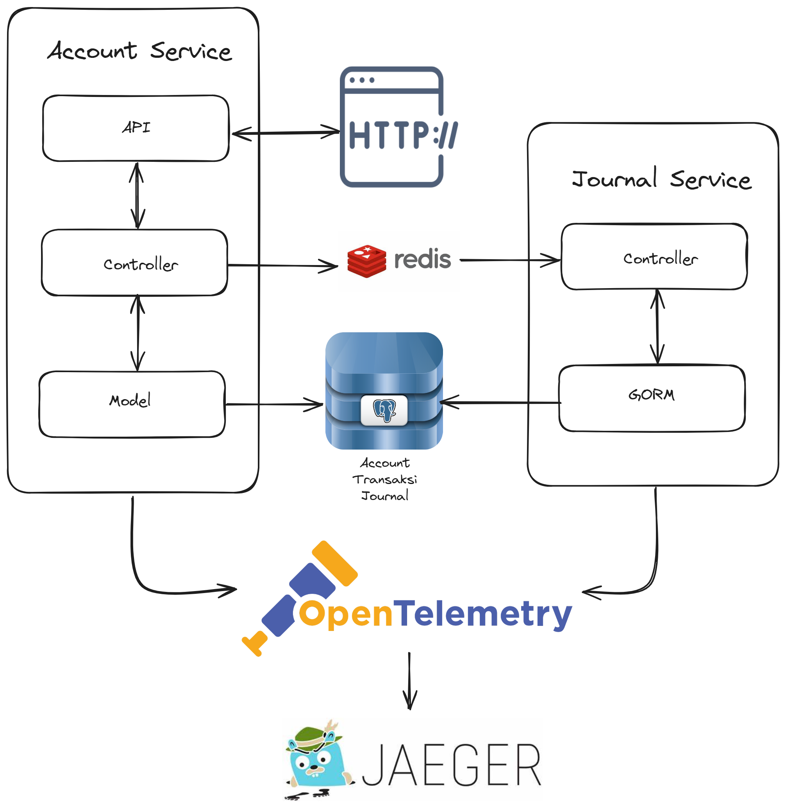
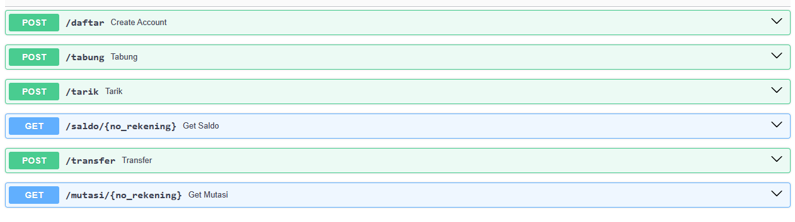

## ASSESMEN ISI 2024
- [Overview](#overview)
- [Installation](#installation)
- [Usage](#usage)
- [License](#license)

## Overview



### Routes


The apps demonstrate a simple architecture that utilize Kafka as the message broker, FastAPI as the accout-service and Go as the journal-service. The account-service is responsible for handling the account and the journal-service is responsible for handling the journal. The account-service will produce a message to the Kafka when a new transaction is created. The journal-service will consume the message and create a new journal then store it in the database. All the services are running in a docker container.

## Installation

### Requirements
- Docker
- Docker Compose
- Python 3.11
- Go 1.17

### How to run
1. Clone this repository
2. Build and run all the services
```powershell
docker-compose up --build
```
3. Hit the API via Postman

## License
[MIT](https://choosealicense.com/licenses/mit/)