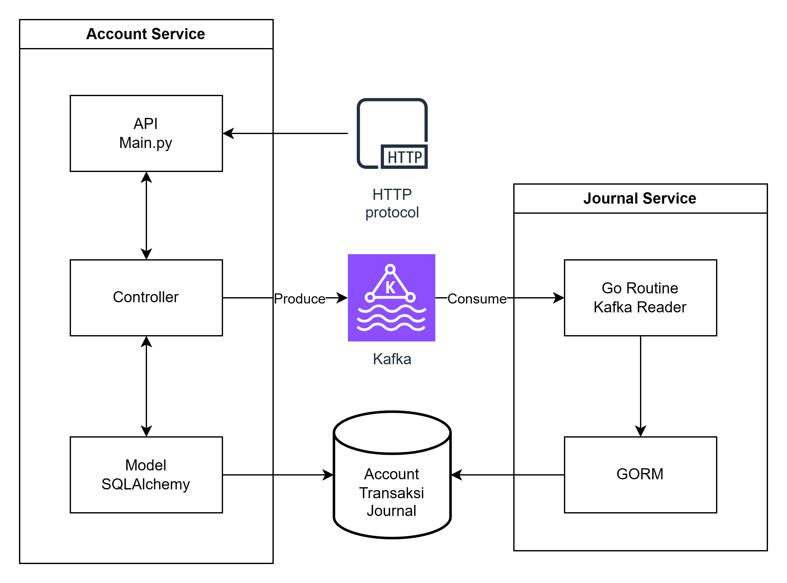

## ASSESMEN ISI 2024
- [Overview](#overview)
- [Installation](#installation)
- [Usage](#usage)
- [Contributing](#contributing)
- [License](#license)

## Overview



### Routes


## Installation

### Requirements
- Docker
- Docker Compose
- Python 3.11
- Go 1.17

### How to run
1. Clone this repository
2. Build the docker image in accout-service 
```powershell
cd account-service
docker build -t account-service .
cd ..
```
3. Build the docker image in journal-service 
```powershell
cd journal-service
docker build -t journal-service .
cd ..
```
4. Run the docker-compose
```powershell
docker-compose up
```
5. Hit the API via Postman

## Contributing

Guidelines for contributing to your project.

## License

Information about the license for your project.